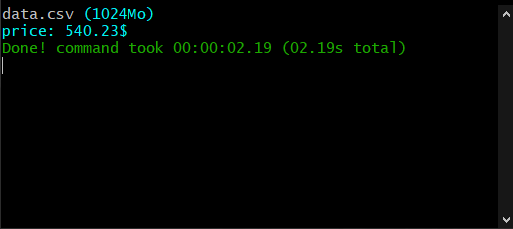

# Pducky

This is a basic PHP [DuckDB](https://duckdb.org/) adapter, that executes SQL queries on large data files (CSV).  
Using SQLite database & automated CSV parser.  

*-Its actualy a "POC" alpha version, Wokring in progress on a built-in PHP API for DuckDB-*

## Teseted:

* With large CSV of 1M rows **1Go**.
* On **Windows** 10 Pro x64 | i7 13700K | 32Go RAM | SSD NVMe.
* On **Linux** Debian 11 | Xeon-E 2224 | 16Go RAM | SSD.

## Benchmark:



## Requirements:

* PHP **sqlite3**
* PHP **exec()**

## Install:

```
composer require jakiboy/pducky
```

## Example:

```php

$price = (new Pducky\Adapter('data.csv'))->import()->single(
    'SELECT `price` FROM temp WHERE `ean` = "0000123456789";'
);

echo $price; // 540.23$
```

## Authors:

* [Jakiboy](https://github.com/Jakiboy) (*Initial work*)

## ⭐ Support:

Please give it a Star if you like the project.
