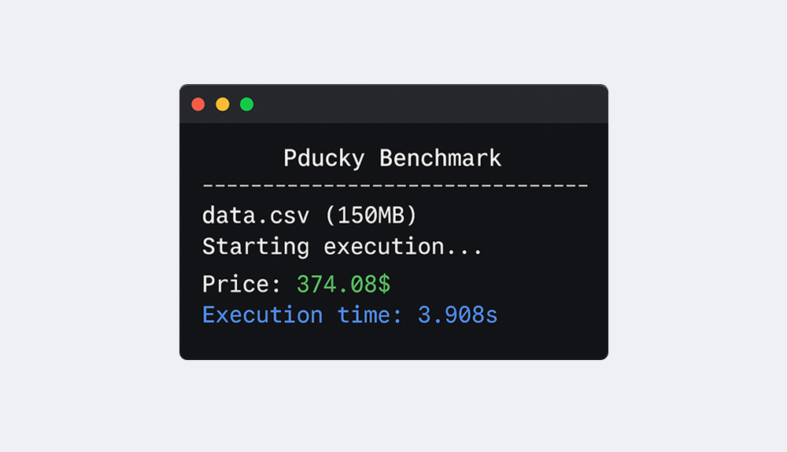

# Pducky

[](#)

High-performance PHP adapter for [DuckDB](https://duckdb.org/) that executes SQL queries directly on massive datasets (CSV, JSON, Parquet) without preprocessing or imports. Features SQLite-compatible interface, FFI integration, and intelligent CSV parsing for zero-ETL analytics on files up to gigabytes in size.

## Benchmark:

Tested with a large CSV dataset containing 1 million rows (**150 MB**) using PHP v8.3.  
> **Note:** No optimizations were applied. The benchmark includes database creation from compressed CSV and query execution.

[](#)

| CPU           | Memory        | Disk     | OS                     | Timing     |
| ------------- |:-------------:| --------:| ----------------------:| ----------:|
| i7 (13K)      | 32 Go         | NVMe     | **Windows** 10 Pro x64 | **2.19s**  |
| i7 (8)        | 8 Go          | NVMe     | **Windows** 10 Pro x64 | **3.054s** |
| Xeon (E22)    | 16 Go         | SSD      | **Linux** Debian 11    | **3.58s**  |
| *i3 (3)*      | *8 Go*        | *SSD*    | *Windows 10 Pro x64*   | *30.23s*   |

## Requirements:

* PHP **exec** function
* PHP **SQLite3** extension
* PHP **FFI** extension (Used by Loader)

## Install:

```bash
composer require jakiboy/pducky
```

> **Note**: DuckDB binaries are automatically downloaded during installation.

## Test:

```bash
git clone https://github.com/Jakiboy/pducky.git
cd pducky/examples
bash generate.sh
bash test.sh
```

## Examples:

### Fetch single value:

```php
$price = (new Pducky\Adapter('data.csv'))->import()->single(
	'SELECT `price` FROM `temp` WHERE `ean` = "4567890123456";'
); // 374.08$
```

### Fetch rows:

```php
$rows = (new Pducky\Adapter('data.csv'))->import()->query(
	'SELECT * FROM `temp` LIMIT 100;'
); // []
```

### Create database:

Create database `data` with table `product` from a compressed CSV file `data.csv.gz`.

```php
(new Pducky\Adapter('data.csv.gz'))->import('data', 'product');
```

### Loader query (FFI):

```php
$rows = (new Pducky\Loader())->connect('data.db')
	   ->importCsv('data.csv', 'product')
	   ->query('SELECT * FROM product LIMIT 100;'); // []
```

## References:

* [SQL Introduction](https://duckdb.org/docs/stable/sql/introduction)
* [Importing Data](https://duckdb.org/docs/stable/data/overview)

## Authors:

* [Jakiboy](https://github.com/Jakiboy) (*Initial work*)

## ⭐ Support:

Skip the coffee! If you like the project, a Star would mean a lot.
